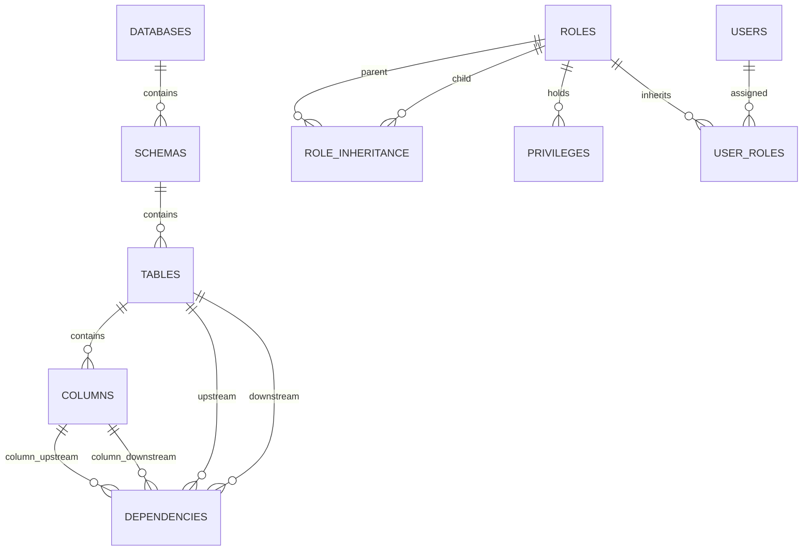

# Technical Architecture Document: ImpactGraph

This document describes the high-level architecture, database schemas, sync pipeline operations, graph representations, and deployment topologies of the ImpactGraph platform.

---

## 1. High-Level Architecture Overview

ImpactGraph uses a standard three-tier architecture designed for self-hosting and scaling.

```text
       ┌─────────────────────────────────────────────────────────────┐
       │                       WEB FRONTEND                          │
       │                   (React / TypeScript)                      │
       └──────────────────────────────┬──────────────────────────────┘
                                      │ REST API / JSON
                                      ▼
       ┌─────────────────────────────────────────────────────────────┐
       │                        BACKEND API                          │
       │                     (Python / FastAPI)                      │
       └─────┬────────────────────────┬────────────────────────┬─────┘
             │                        │                        │
             │ SQL / Alchemy          │ In-Memory Graph        │ Run Job
             ▼                        ▼                        ▼
┌────────────────────────┐ ┌────────────────────────┐ ┌────────────────────────┐
│   POSTGRESQL DB        │ │    GRAPH ENGINE        │ │   INGESTION PIPELINE   │
│ (Metadata/Audit Logs)  │ │ (NetworkX Graph Cache) │ │  (APScheduler Worker)  │
└────────────────────────┘ └────────────────────────┘ └───────────┬────────────┘
                                                                  │ Metadata Queries
                                                                  ▼
                                                     ┌────────────────────────┐
                                                     │    SNOWFLAKE DWH       │
                                                     │ (Metadata Ingestion)   │
                                                     └────────────────────────┘
```

### Component Details
1.  **Web Frontend:** A modern single-page application built using React and TypeScript. It handles rendering searchable tables, the interactive lineage canvas, and RBAC diagrams.
2.  **Backend API:** Built with Python and FastAPI. Serves API endpoints, handles configuration encryption, manages database sessions, and executes graph queries.
3.  **PostgreSQL Database:** The transactional system of record. Stores Snowflake connection credentials, ingested schemas, table metadata, lineage relationships, and manual audit histories.
4.  **Graph Engine:** Runs in-memory inside the Python backend using the `NetworkX` library. It caches table and column adjacency lists from the DB for sub-millisecond path traversals and blast radius score calculations.
5.  **Ingestion Pipeline:** An asynchronous background worker that executes scheduled sync jobs. It connects to external platforms (like Snowflake), extracts metadata, parses SQL view queries, and writes to PostgreSQL.

---

## 2. Database Schema (PostgreSQL Entity-Relationship Model)

ImpactGraph maps database structures into a relational schema. The schema supports version tracking and soft-deletes to represent schema changes over time.



### Table Definitions

#### `databases`
Stores the metadata repositories connected to ImpactGraph.
*   `id` (UUID, Primary Key)
*   `name` (VARCHAR, Unique identifier, e.g., `prod_dwh`)
*   `platform` (VARCHAR, e.g., `snowflake`)
*   `connection_config` (TEXT, encrypted AES-256 string containing host, warehouse, user, credentials)
*   `created_at` (TIMESTAMP)

#### `schemas`
*   `id` (UUID, Primary Key)
*   `database_id` (UUID, Foreign Key referencing `databases.id`)
*   `name` (VARCHAR)
*   `created_at` (TIMESTAMP)

#### `tables`
Stores tables, views, and external stages.
*   `id` (UUID, Primary Key)
*   `schema_id` (UUID, Foreign Key referencing `schemas.id`)
*   `name` (VARCHAR)
*   `type` (VARCHAR, e.g., `BASE TABLE`, `VIEW`, `MATERIALIZED VIEW`)
*   `row_count` (BIGINT, Nullable)
*   `byte_size` (BIGINT, Nullable)
*   `owner` (VARCHAR)
*   `description` (TEXT, Nullable)
*   `created_at` (TIMESTAMP)
*   `updated_at` (TIMESTAMP)
*   `is_deleted` (BOOLEAN, default `FALSE`)

#### `columns`
*   `id` (UUID, Primary Key)
*   `table_id` (UUID, Foreign Key referencing `tables.id`)
*   `name` (VARCHAR)
*   `data_type` (VARCHAR)
*   `is_nullable` (BOOLEAN)
*   `description` (TEXT, Nullable)
*   `is_deleted` (BOOLEAN, default `FALSE`)

#### `dependencies`
Stores structural graph edges (directed link from upstream to downstream).
*   `id` (UUID, Primary Key)
*   `type` (VARCHAR, e.g., `table_to_table`, `column_to_column`)
*   `upstream_table_id` (UUID, Foreign Key referencing `tables.id`)
*   `downstream_table_id` (UUID, Foreign Key referencing `tables.id`)
*   `upstream_column_id` (UUID, Foreign Key referencing `columns.id`, Nullable)
*   `downstream_column_id` (UUID, Foreign Key referencing `columns.id`, Nullable)
*   `dependency_type` (VARCHAR, e.g., `view_definition`, `foreign_key`)

#### `roles`
*   `id` (UUID, Primary Key)
*   `database_id` (UUID, Foreign Key referencing `databases.id`)
*   `name` (VARCHAR)

#### `role_inheritance`
*   `parent_role_id` (UUID, Foreign Key referencing `roles.id`)
*   `child_role_id` (UUID, Foreign Key referencing `roles.id`)

#### `privileges`
*   `id` (UUID, Primary Key)
*   `role_id` (UUID, Foreign Key referencing `roles.id`)
*   `privilege_type` (VARCHAR, e.g., `SELECT`, `INSERT`, `OWNERSHIP`)
*   `target_object_id` (UUID) -- ID of the database, schema, table or column
*   `target_object_type` (VARCHAR, e.g., `TABLE`, `SCHEMA`)

---

## 3. Ingestion & SQL Parsing Sync Pipeline

```text
1. Trigger Sync ➔ 2. Metadata Query ➔ 3. SQL View Extraction ➔ 4. Parsing Engine ➔ 5. Graph Sync
```

1.  **Job Trigger:** A background thread running `APScheduler` executes a sync job based on a user-configured cron schedule.
2.  **Metadata Querying:** The Snowflake connector connects to the warehouse and queries `INFORMATION_SCHEMA` and `ACCOUNT_USAGE` schemas to retrieve lists of databases, tables, columns, roles, grants, and view definition DDL strings.
3.  **View Lineage Extraction:** For every view, the engine takes the `view_definition` SQL text and passes it to our SQL parsing engine.
4.  **SQL Parsing:** The parser extracts table references (e.g., `FROM database.schema.table`) and column mappings (e.g., `SELECT price * qty AS total_price`). This converts raw SQL query text into structured `dependencies` records.
5.  **Write Transaction:** The engine writes these records to PostgreSQL in an atomic transaction to ensure zero partial ingest states.

---

## 4. Graph Engine & Traversal Calculations

Rather than deploying a dedicated, resource-heavy graph database like Neo4j, ImpactGraph models relationships in PostgreSQL tables and processes traversals in two ways:

### I. SQL Recursive CTEs (For fast, lightweight database-level queries)
To find all downstream dependencies of a table directly in SQL:
```sql
WITH RECURSIVE lineage_tracker AS (
    -- Anchor member
    SELECT 
        upstream_table_id, 
        downstream_table_id,
        1 AS level
    FROM dependencies
    WHERE upstream_table_id = :start_table_id
    
    UNION ALL
    
    -- Recursive member
    SELECT 
        d.upstream_table_id, 
        d.downstream_table_id,
        lt.level + 1
    FROM dependencies d
    JOIN lineage_tracker lt ON d.upstream_table_id = lt.downstream_table_id
)
SELECT DISTINCT downstream_table_id, level FROM lineage_tracker;
```

### II. In-Memory NetworkX Cache (For complex analytical traversals)
*   At startup or after sync completion, the backend fetches all rows from `dependencies` and builds an in-memory directed graph (DAG) using the Python `NetworkX` library.
*   Path operations (e.g., *Is there a path from Table A to Table Z?*, *Compute degree centrality*, *Shortest lineage path*) are served instantly from memory, avoiding recursive database querying.

---

## 5. Deployment Topology (Docker Compose)

ImpactGraph is packaged as a multi-container Docker application:

```text
                               ┌─────────────────┐
                               │  Reverse Proxy  │
                               │     (Nginx)     │
                               └────────┬────────┘
                                        │ Port 80
                                        ▼
                        ┌───────────────┴───────────────┐
                        │                               │
                        ▼                               ▼
               ┌─────────────────┐             ┌─────────────────┐
               │    Frontend     │             │     Backend     │
               │   (React app)   │             │ (FastAPI App)   │
               └─────────────────┘             └────────┬────────┘
                                                        │
                                                        ▼
                                               ┌─────────────────┐
                                               │   PostgreSQL    │
                                               │   (Data Store)  │
                                               └─────────────────┘
```

*   **Database Container:** Standard Postgres image with persistent volume mapping (`/var/lib/postgresql/data`).
*   **Backend Container:** Python image executing FastAPI on port `8000`. Runs background threads for scheduled ingestion syncs.
*   **Frontend Container:** Built using Node, serves compiled React static assets through an embedded Nginx server on port `80` (routing `/api/` calls upstream to the backend).
